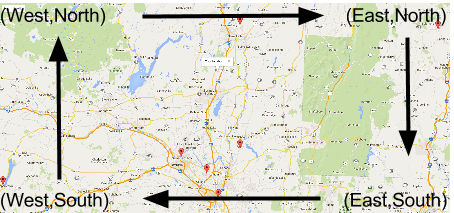

geoJSON data with MongoDB
=========================

This project is a self-contained demonstration of
using geographical data with MongoDB. It consists
of a dataset of airports & train stations along with a
simple web-app leveraging Google Maps to interactively
mark the transit stations depending on what area viewable
on the map.

This README is meant as a tutorial, walking through the
installation, components and data structures required to
leverage basic geographical data within MongoDB.

## Requirements

Python 2.7+ & pymongo
Local MongoDB
Your Google Maps API key

## Getting Started &

Clone this repository.

Start a local MongoDB instance.

Load data into Mongo

```
mongoimport -d test -c airports.raw --headerline \
            --type=csv AirportList.csv
```

Now, we need to convert the raw geographical data into
the geoJSON format. getJSON is an independent specification
for encoding arbitrary spatial data within JSON, this includes geographical
 data. The full specification is found at http://geojson.org/ and a good
  place to get to know geoJSON is http://geojson.io/.

Our raw data consists of a comma-delimited file where each line in the file
 represents a record of data. For each record we will create a MongoDB
  document in a collection called ``airports`` (note we loaded the csv data
     into a collection called ``airports.raw``). We must now figure out
how best to convert the csv geographical data into geoJSON format.

Each raw documents looks like this:

```
{
	"_id" : ObjectId("578fc6aa433818b1f9323b87"),
	"ID" : 11208,
	"Code" : "KHZ",
	"Country" : "PF",
	"StateCode" : "NULL",
	"Longitude" : "145.7.42W",
	"Latitude" : "15.46.50S",
	"Fplat" : -0.2754226522,
	"Fplon" : -0.2447533388,
	"Active" : 0,
	"Wright" : 0,
	"Sync" : 0,
	"Name" : "Kauehi",
	"CityCode" : "NULL",
	"LastModifiedDate" : "00:00.0"
}
```

Note the ```Longitude``` and ```Latitude``` keys which have the
degrees.minutes.secondsDirection format. geoJSON requires this format:

```
{
		"type" : "Point",
		"coordinates" : [
			-145.12833333333333,
			-15.780555555555557
		]
	}
```

This is how to specify a point. The coordinates here are
[ latitude, longitude] in decimal format. So we have some work to do
to convert these data. Here is the conversion formula

```
decimal = degrees + (minutes/60) + (seconds/3600)
if ( Direction is W or S) then
  decimal = -decimal
```
This logic is implemented in the [createGeoJson.js](creatGeoJson.js)
script, which you can run with:

```
mongo createGeoJson.js
```

(The [load-data.sh](load-data.sh) helper script does the import
and conversion.)

The application is served from a local Python server
implemented in [rest-api.py](rest-api.py). This script
listens on a port for HTTP requests. It can serve the
[static/airports.html](static/airports.html) file or
respond to PORT requests to get a list of airports
within a given region.

[airports.html](static/airports.html) contains the
Google Maps API code, and is pretty much a straight rip off the examples
 Google posts. We added a few functions which
fire off events to callback to the python script with the (East, North)
 and (West, South) boundary points from the currently displayed map
 (conveniently in decimal format).

The POST request is handled in [rest-api.py](rest-api.py):

```
bounds = json.loads(web.data())
mongo = pymongo.MongoClient("localhost:29009")
airports = mongo['test']['airports']
query = { "location" : { "$geoWithin" : {
    "$geometry" : {
        "type" : "Polygon",
        "coordinates" : [ [
            [ bounds['east'], bounds['north'] ],
            [ bounds['east'], bounds['south'] ],
            [ bounds['west'], bounds['south'] ],
            [ bounds['west'], bounds['north'] ],
            [ bounds['east'], bounds['north'] ]
        ] ]
    }
}}}
project = { "_id" : 0 }
airport_data = []
    results = airports.find(query,project)
    while results.alive:
        try:
            airport = results.next()
            print(airport)
            airport_data.append(airport)
        except StopIteration:
            print("cursor done")
    return json.dumps(airport_data)
```

For the query to MongoDB we create a Polygon from the two coordinates
 which Google Maps gives. An example map;



Posts
```
{ u'west': -74.95311758476561,
  u'east': -72.44823477226561,
  u'north': 43.44460680843689,
  u'south': 42.5719574637479 }
```

This converts into the following ```location``` attribute for our ```find()``` query predicate:
```
{'location': {
  '$geoWithin': {
    '$geometry': {
      'type': 'Polygon',
      'coordinates': [
                      [
                      [-72.44823477226561, 43.44460680843689],
                      [-72.44823477226561, 42.5719574637479],
                      [-74.95311758476561, 42.5719574637479],
                      [-74.95311758476561, 43.44460680843689],
                      [-72.44823477226561, 43.44460680843689]
                      ]
                     ]
     }
    }
  }
}
```

Yes, the coordinates are an array with one element, an array which itself
 is an array of the [lat,long] points. Also note that we must
 "close the loop" and specify the starting point again at the end to complete
 the polygon definition.

The results returned are an array of these type of documents:

```
{u'code': u'COP', u'name': u'COOPERSTOWN', u'location': {u'type': u'Point', u'coordinates': [-74.93333333333334, 42.7]}}
{u'code': u'ZLY', u'name': u'ALBANY NY RAIL STATION', u'location': {u'type': u'Point', u'coordinates': [-73.73777777777778, 42.64722222222222]}}
{u'code': u'ALB', u'name': u'Albany, NY (ALB)', u'location': {u'type': u'Point', u'coordinates': [-73.80166666666666, 42.748333333333335]}}
{u'code': u'SCH', u'name': u'Schenectady, NY (SCH-County)', u'location': {u'type': u'Point', u'coordinates': [-73.61666666666666, 42.85]}}
{u'code': u'ZTD', u'name': u'SCHENECTADY RAIL STATION', u'location': {u'type': u'Point', u'coordinates': [-73.94333333333334, 42.81527777777777]}}
{u'code': u'GFL', u'name': u'Glens Falls, NY (GFL-Warren County)', u'location': {u'type': u'Point', u'coordinates': [-73.61666666666666, 43.35]}}
{u'code': u'VSF', u'name': u'Springfield, VT (VSF-State)', u'location': {u'type': u'Point', u'coordinates': [-72.51666666666667, 43.333333333333336]}}
```

Start the python server with:

$python ./rest-api.py

And then open up [http://localhost:8080](http://localhost:8080).

(airports.html)[static/airports.html] contains a variable
``numSecondsBetweenAirportQueries`` which controls how
often a request for airport data can fire off (the ```bounds-changed``` event
  can fire off very often.)
